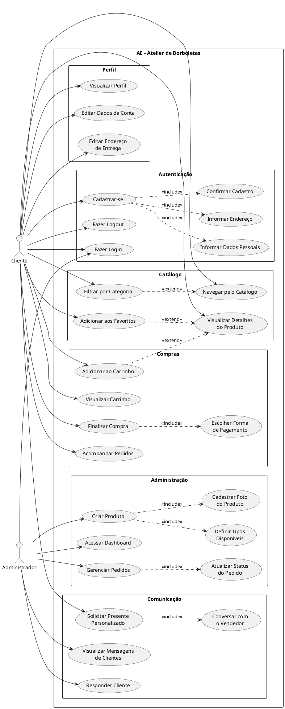

# Ateliê Encantado

Aplicativo mobile desenvolvido com React Native, Expo e Expo Router para apresentar produtos artesanais, organizar favoritos e carrinho, além de oferecer um fluxo de cadastro para clientes e acesso administrativo.

## Objetivo

O Ateliê Encantado permite que clientes conheçam o catálogo, criem um perfil, favoritem produtos e preparem um carrinho de encomendas. O projeto também prevê uma área administrativa para acompanhar pedidos e gerenciar produtos.

## Tecnologias

- React Native
- Expo SDK 57
- Expo Router
- TypeScript
- React Context API

## Fluxo principal

```text
Cliente sem conta
  └─ Perfil
      ├─ Cadastrar
      │   ├─ Dados pessoais
      │   ├─ Endereço
      │   └─ Conferência → Home
      └─ Logar → Home

Home
  ├─ Favoritos
  ├─ Carrinho
  └─ Perfil
      ├─ Dados da conta
      ├─ Endereço de entrega
      ├─ Meus pedidos
      └─ Conversar com o vendedor

Administrador
  └─ Login administrativo → Dashboard
```

## Funcionalidades já implementadas

### Cliente

- Cadastro dividido em três etapas: dados pessoais, endereço e confirmação.
- Validação de campos obrigatórios e confirmação de senha.
- Criação de perfil em memória após concluir o cadastro.
- Redirecionamento para a Home após cadastrar.
- Exibição do primeiro nome da cliente na Home.
- Navegação por abas: Home, Favoritos, Carrinho e Perfil.
- Inclusão e remoção de produtos dos favoritos e do carrinho.
- Exibição dos dados básicos do perfil criado.
- Navegação para Dados da conta, Endereço de entrega, Meus pedidos e Conversar com o vendedor.
- Mensagem “Ainda em desenvolvimento” nas telas que ainda não receberam conteúdo.

### Administração

- Tela de login administrativo.
- Validação de demonstração com as credenciais abaixo:

```text
E-mail: adm@gmail.com
Senha: Adm
```

- Redirecionamento para o Dashboard administrativo.

## Funcionalidades previstas

Estas funcionalidades fazem parte do diagrama de casos de uso, mas ainda precisam ser implementadas:

- Detalhes de produto e filtro por categoria.
- Finalização de compra e escolha de pagamento.
- Histórico e acompanhamento de pedidos.
- Edição dos dados da conta e endereço de entrega.
- Conversa com o vendedor ou integração com WhatsApp.
- Logout.
- Gerenciamento de pedidos e produtos no Dashboard.
- Persistência de dados em banco de dados ou armazenamento local.
- Login e autenticação reais.

## Estrutura de telas

```text
src/app/
├── context/
│   └── StoreContext.tsx
├── loguin/
│   ├── cadastro.tsx
│   ├── logar-adm.tsx
│   └── logar-cliente.tsx
├── telas-adm/
│   └── Dashboard.tsx
└── telas-cliente/
    ├── index.tsx
    ├── favoritos.tsx
    ├── carrinho.tsx
    ├── perfil.tsx
    ├── dados-conta.tsx
    ├── endereco-entrega.tsx
    ├── meus-pedidos.tsx
    └── conversar-vendedor.tsx
```

## Estado compartilhado

O arquivo `src/app/context/StoreContext.tsx` centraliza os dados usados entre as telas:

- perfil da cliente;
- produtos favoritados;
- produtos adicionados ao carrinho.

No momento, esses dados existem apenas enquanto o aplicativo está aberto.

## Como executar

1. Instale as dependências:

```bash
npm install
```

2. Inicie o projeto:

```bash
npm start
```

3. Use o Expo Go, um emulador ou a versão web para abrir o aplicativo.

## Diagrama de Casos de Uso (UML)


