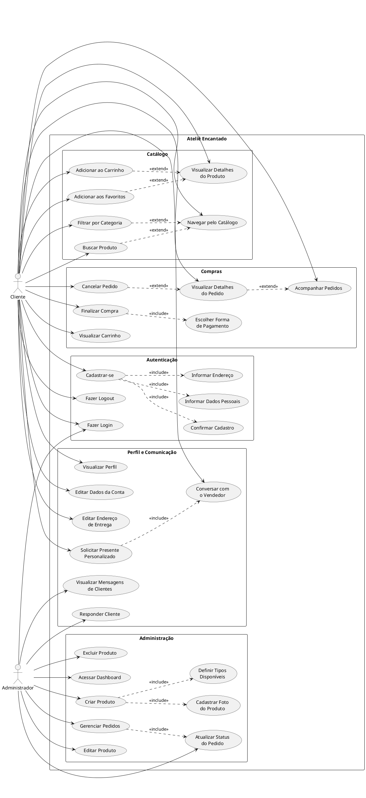
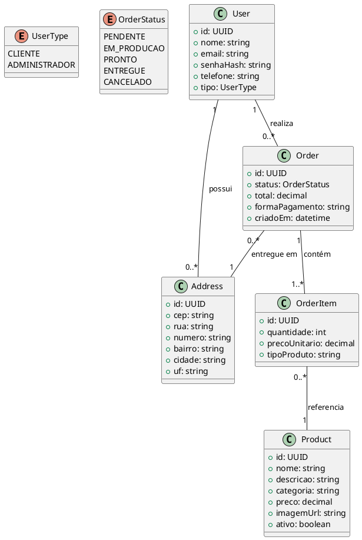

# Ateliê Encantado

Aplicativo mobile para catálogo e encomenda de produtos artesanais. O projeto possui uma área para clientes e uma área administrativa e será integrado a uma API REST e a um banco de dados PostgreSQL.

## Objetivo

Permitir que clientes conheçam os produtos do Ateliê Encantado, pesquisem e filtrem o catálogo, favoritem itens, montem um carrinho e acompanhem pedidos. A administração poderá cadastrar, editar e remover produtos, registrar a foto de um produto com a câmera do dispositivo e acompanhar os pedidos.

## Protótipo no Figma

O protótipo visual está disponível no [Figma](https://www.figma.com/design/h0Rj459fZuEKZgxicFDfzg/atelie-encantado?node-id=0-1&t=6UX2LuSximgr3LcL-1).

## Tecnologias

### Aplicativo mobile

- React Native;
- Expo SDK 57;
- Expo Router;
- TypeScript;
- React Context API.

### Back-end planejado

- Node.js;
- Express;
- TypeScript;
- PostgreSQL;
- Prisma ORM;
- Postman ou Insomnia para testar a API.

## Arquitetura

O projeto seguirá uma arquitetura cliente-servidor. O aplicativo não acessará o banco de dados diretamente: ele consumirá uma API REST, responsável pelas regras de negócio e pela persistência no PostgreSQL.

```text
Aplicativo Expo / React Native
        |
        | HTTP (JSON)
        v
API REST — Node.js / Express
        |
        | Prisma ORM
        v
Banco de dados PostgreSQL
```

Estrutura prevista para a evolução do repositório:

```text
atelie-encantado/
├── src/                         # aplicação Expo
│   ├── app/
│   ├── components/
│   └── hooks/
├── backend/                     # API REST
│   ├── prisma/
│   │   └── schema.prisma
│   └── src/
│       ├── controllers/         # recebe requisições e devolve respostas HTTP
│       ├── routes/              # define os endpoints
│       ├── services/            # regras de negócio
│       ├── middlewares/          # validação e tratamento de erros
│       └── server.ts
└── README.md                    # documentação completa do projeto
```

> O diretório `backend/` ainda será criado. Até sua integração, os dados do aplicativo permanecem em memória no `StoreContext`.

## Fluxo principal

```text
Cliente sem conta
  └─ Perfil
      ├─ Cadastrar
      │   ├─ Dados pessoais
      │   ├─ Endereço
      │   └─ Conferência → Home
      └─ Logar → Home

Cliente autenticado
  ├─ Catálogo → categoria/pesquisa → detalhes do produto
  ├─ Favoritos
  ├─ Carrinho → checkout → pedido
  └─ Perfil → dados, endereço, pedidos e conversa com vendedor

Administrador
  └─ Login administrativo → dashboard → produtos e pedidos
```

## Funcionalidades já implementadas

### Cliente

- Cadastro dividido em dados pessoais, endereço e confirmação;
- validação de campos obrigatórios e confirmação de senha;
- criação de perfil em memória após o cadastro;
- navegação por abas: Home, Favoritos, Carrinho e Perfil;
- inclusão e remoção de dois produtos de demonstração dos favoritos e do carrinho;
- exibição do primeiro nome da cliente na Home;
- navegação para Dados da Conta, Endereço de Entrega, Meus Pedidos e Conversar com o Vendedor.

### Administração

- Tela de login administrativo demonstrativa;
- redirecionamento para o Dashboard.

Credenciais de demonstração:

```text
E-mail: adm@gmail.com
Senha: Adm
```

## Funcionalidades previstas

- Listagem de produtos por categoria, busca e detalhes do produto;
- escolha de tipo do produto e finalização de compra;
- criação, histórico, detalhes, cancelamento e acompanhamento de pedidos;
- edição dos dados de conta e endereço de entrega;
- conversa com o vendedor ou integração com WhatsApp;
- logout e autenticação real;
- dashboard e gerenciamento de pedidos e produtos;
- persistência no PostgreSQL por meio da API;
- uso da câmera para registrar a foto de um produto no cadastro administrativo.

## Casos de uso

Além dos casos existentes no protótipo inicial, foram adicionados os seguintes casos de uso para a evolução do sistema:

1. Buscar produto por nome;
2. Editar produto;
3. Excluir produto;
4. Visualizar detalhes do pedido;
5. Cancelar pedido.

Os cinco casos acima são novos no diagrama. Para a API, serão priorizados os casos de listar/buscar produto, criar produto, finalizar compra (criar pedido) e visualizar detalhes do pedido. A atualização de status será implementada como caso adicional administrativo.

## Diagrama de Casos de Uso (UML)


```plantuml
@startuml Diagrama de Casos de Uso - Ateliê Encantado

left to right direction
skinparam packageStyle rectangle

actor "Cliente" as C
actor "Administrador" as A

rectangle "Ateliê Encantado" {
 package "Autenticação" {
    usecase "Fazer Login" as UC1
    usecase "Cadastrar-se" as UC2
    usecase "Informar Dados Pessoais" as UC2a
    usecase "Informar Endereço" as UC2b
    usecase "Confirmar Cadastro" as UC2c
    usecase "Fazer Logout" as UC3
  }

  package "Catálogo" {
    usecase "Navegar pelo Catálogo" as UC4
    usecase "Filtrar por Categoria" as UC5
    usecase "Buscar Produto" as UC24
    usecase "Visualizar Detalhes\ndo Produto" as UC6
    usecase "Adicionar aos Favoritos" as UC7
    usecase "Adicionar ao Carrinho" as UC8
  }

  package "Compras" {
    usecase "Visualizar Carrinho" as UC9
    usecase "Finalizar Compra" as UC10
    usecase "Escolher Forma\nde Pagamento" as UC11
    usecase "Acompanhar Pedidos" as UC12
    usecase "Visualizar Detalhes\ndo Pedido" as UC25
    usecase "Cancelar Pedido" as UC26
  }

  package "Perfil e Comunicação" {
    usecase "Visualizar Perfil" as UC13
    usecase "Editar Dados da Conta" as UC14
    usecase "Editar Endereço\nde Entrega" as UC15
    usecase "Solicitar Presente\nPersonalizado" as UC16
    usecase "Conversar com\no Vendedor" as UC17
    usecase "Visualizar Mensagens\nde Clientes" as UC18
    usecase "Responder Cliente" as UC19
  }

  package "Administração" {
    usecase "Acessar Dashboard" as UC20
    usecase "Gerenciar Pedidos" as UC21
    usecase "Atualizar Status\ndo Pedido" as UC22
    usecase "Criar Produto" as UC23
    usecase "Editar Produto" as UC27
    usecase "Excluir Produto" as UC28
    usecase "Cadastrar Foto\ndo Produto" as UC23a
    usecase "Definir Tipos\nDisponíveis" as UC23b
  }
}

C --> UC1
C --> UC2
C --> UC3
C --> UC4
C --> UC5
C --> UC24
C --> UC6
C --> UC7
C --> UC8
C --> UC9
C --> UC10
C --> UC12
C --> UC25
C --> UC26
C --> UC13
C --> UC14
C --> UC15
C --> UC17
C --> UC16

A --> UC1
A --> UC20
A --> UC21
A --> UC22
A --> UC23
A --> UC27
A --> UC28
A --> UC18
A --> UC19

UC5 ..> UC4 : <<extend>>
UC24 ..> UC4 : <<extend>>
UC7 ..> UC6 : <<extend>>
UC8 ..> UC6 : <<extend>>
UC2 ..> UC2a : <<include>>
UC2 ..> UC2b : <<include>>
UC2 ..> UC2c : <<include>>
UC10 ..> UC11 : <<include>>
UC25 ..> UC12 : <<extend>>
UC26 ..> UC25 : <<extend>>
UC23 ..> UC23a : <<include>>
UC23 ..> UC23b : <<include>>
UC21 ..> UC22 : <<include>>
UC16 ..> UC17 : <<include>>
@enduml
```

## Modelo de domínio — Diagrama de Classes

O diagrama abaixo representa o domínio do back-end. Ele também orienta as tabelas e os relacionamentos no PostgreSQL.


```plantuml
@startuml Diagrama de Classes - Ateliê Encantado

enum UserType {
  CLIENTE
  ADMINISTRADOR
}

enum OrderStatus {
  PENDENTE
  EM_PRODUCAO
  PRONTO
  ENTREGUE
  CANCELADO
}

class User {
  +id: UUID
  +nome: string
  +email: string
  +senhaHash: string
  +telefone: string
  +tipo: UserType
}

class Address {
  +id: UUID
  +cep: string
  +rua: string
  +numero: string
  +bairro: string
  +cidade: string
  +uf: string
}

class Product {
  +id: UUID
  +nome: string
  +descricao: string
  +categoria: string
  +preco: decimal
  +imagemUrl: string
  +ativo: boolean
}

class Order {
  +id: UUID
  +status: OrderStatus
  +total: decimal
  +formaPagamento: string
  +criadoEm: datetime
}

class OrderItem {
  +id: UUID
  +quantidade: int
  +precoUnitario: decimal
  +tipoProduto: string
}

User "1" -- "0..*" Address : possui
User "1" -- "0..*" Order : realiza
Order "1" -- "1..*" OrderItem : contém
OrderItem "0..*" -- "1" Product : referencia
Order "0..*" -- "1" Address : entregue em
@enduml
```

## Banco de dados PostgreSQL

O banco terá, no mínimo, as cinco tabelas abaixo. Assim, atende ao requisito mínimo de três tabelas persistidas e permite representar pedidos com vários itens.

| Tabela | Finalidade | Relações principais |
| --- | --- | --- |
| `users` | Clientes e administradores | Um usuário possui endereços e pedidos. |
| `addresses` | Endereços de entrega | Pertence a um usuário; pode ser usado por pedidos. |
| `products` | Produtos disponíveis no catálogo | É referenciado por itens de pedido. |
| `orders` | Pedido e seu estado | Pertence a um cliente e usa um endereço. |
| `order_items` | Produtos, quantidades e preços de um pedido | Pertence a um pedido e referencia um produto. |

As migrations do Prisma deverão criar as chaves estrangeiras `user_id`, `address_id`, `order_id` e `product_id`. O preço unitário será salvo em `order_items` para preservar o valor da compra caso o preço do catálogo seja alterado posteriormente.

## API REST planejada

Base local de desenvolvimento: `http://localhost:3333`.

| Caso de uso | Método | Rota | Resposta esperada |
| --- | --- | --- | --- |
| Listar ou buscar produtos | `GET` | `/products?search=&category=` | Lista de produtos. |
| Consultar detalhes do produto | `GET` | `/products/:id` | Produto selecionado. |
| Criar produto | `POST` | `/products` | Produto criado. |
| Editar produto | `PUT` | `/products/:id` | Produto atualizado. |
| Excluir produto | `DELETE` | `/products/:id` | Resposta sem conteúdo. |
| Criar pedido | `POST` | `/orders` | Pedido criado com itens. |
| Consultar pedidos do cliente | `GET` | `/orders/customer/:customerId` | Histórico de pedidos. |
| Consultar detalhes do pedido | `GET` | `/orders/:id` | Pedido e seus itens. |
| Atualizar status do pedido | `PATCH` | `/orders/:id/status` | Pedido com status atualizado. |
| Cancelar pedido | `PATCH` | `/orders/:id/cancel` | Pedido com status `CANCELADO`. |

Exemplo de corpo para criar um pedido:

```json
{
  "customerId": "uuid-do-cliente",
  "addressId": "uuid-do-endereco",
  "formaPagamento": "PIX",
  "items": [
    {
      "productId": "uuid-do-produto",
      "quantidade": 1,
      "tipoProduto": "Completo"
    }
  ]
}
```

## Integração com recurso do dispositivo

No fluxo administrativo **Criar Produto**, o aplicativo solicitará permissão para usar a câmera. A foto capturada será mostrada como prévia no formulário e enviada ou associada ao produto cadastrado. Essa funcionalidade atende ao uso de recurso nativo do dispositivo e corresponde à tela de criação de produto prevista no Figma.

## Estado atual e integração futura

Hoje, `src/app/context/StoreContext.tsx` guarda o perfil, favoritos e carrinho somente em memória. Na integração:

1. a Home e as categorias chamarão `GET /products`;
2. o checkout enviará o carrinho para `POST /orders`;
3. Meus Pedidos consumirá `GET /orders/customer/:customerId`;
4. o Dashboard atualizará pedidos por `PATCH /orders/:id/status`;
5. Criar Produto enviará os dados e a foto para `POST /products`.

## Estrutura atual de telas

```text
src/app/
├── context/
│   └── StoreContext.tsx
├── loguin/
│   ├── cadastro.tsx
│   ├── logar-adm.tsx
│   └── logar-cliente.tsx
├── telas-adm/
│   └── Dashboard.tsx
└── telas-cliente/
    ├── index.tsx
    ├── favoritos.tsx
    ├── carrinho.tsx
    ├── perfil.tsx
    ├── dados-conta.tsx
    ├── endereco-entrega.tsx
    ├── meus-pedidos.tsx
    └── conversar-vendedor.tsx
```

## Como executar o aplicativo

1. Entre na pasta do projeto:

```bash
cd atelie-encantado
```

2. Instale as dependências:

```bash
npm install
```

3. Inicie o Expo:

```bash
npm start
```

4. Abra no Expo Go, em um emulador ou no navegador.

## Critérios de entrega

- [x] Documentar a arquitetura proposta.
- [x] Atualizar o diagrama de casos de uso com ao menos quatro casos novos.
- [x] Criar o diagrama de classes do domínio do back-end.
- [x] Definir as tabelas necessárias e o contrato dos endpoints.
- [ ] Criar API REST e implementar os casos de uso priorizados.
- [ ] Criar as migrations e persistir os dados no PostgreSQL.
- [ ] Integrar o aplicativo Expo aos endpoints da API.
- [ ] Integrar câmera no cadastro administrativo de produto.
